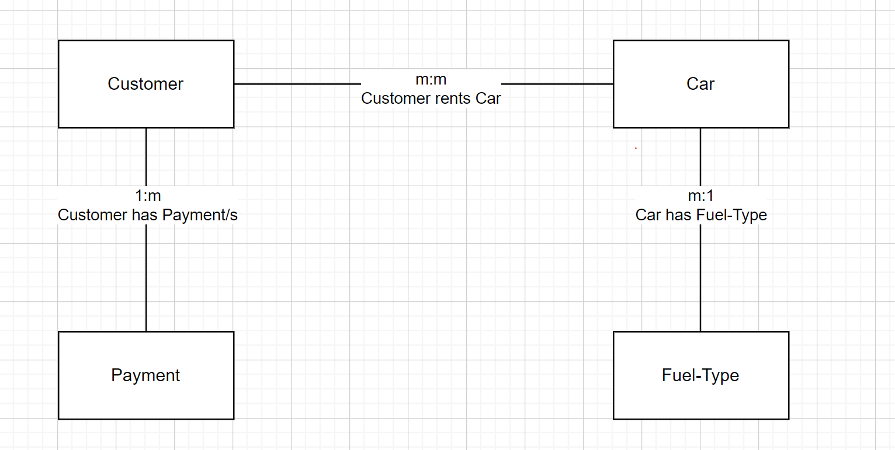
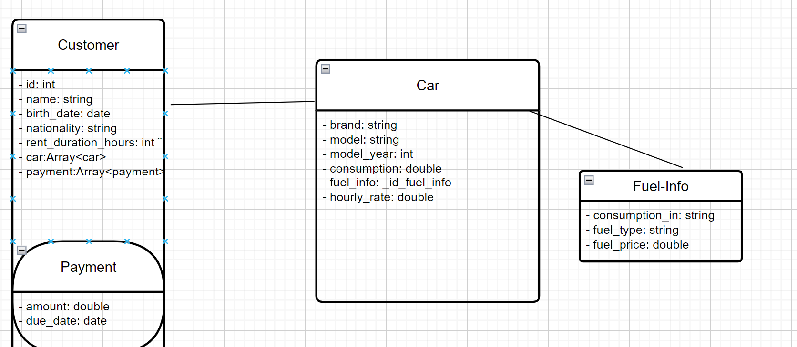
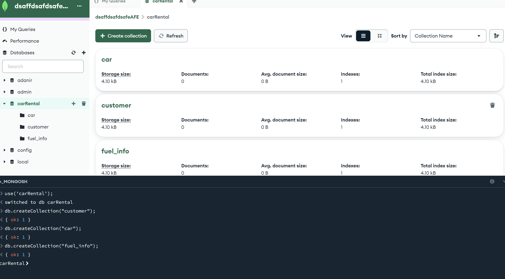

# KN02: Datenmodellierung für MongoDB

### A) Konzeptionelles Datenmodell (40%)




<b>Kurze textuelle Erklärungen zu den Entitäten und Beziehungen.</b>

Entitäten:

- Kunde (`customer`)
- Fahrzeug (`car`)
- Bezahlung (`payment`)
- Treibstoff (`fuel_type`)

Beziehungen:

- `customer` -> `car`: mehrere Kunden können mehrere Autos mieten -> `many-to-many`
- `customer` -> `payment`: ein Kunde kann meherere Bezahlungen haben, eine Bezahlung kann jedoch nur einem Kunden gehören -> `one-to-many`
- `car` -> `fuel_type`: ein Fahrzeug kann einen Treibstoff-Typ haben, ein Treibstoff-Typ kann aber bei mehrern Fahrzeugen aufkommen -> `one-to-many` B

### B) Logisches Modell für MongoDB (50%)




<b>Erklärung zu Verschachtelungen. wieso haben Sie Ihre Variante gewählt.</b>

Ich habe diese Variante ausgewählt, da sie Redundanz vermeidet und relevante Informationen logisch zusammen hält.

- `fuel_type` ist im Gegensatz zu `payment` nicht verschachtelt, da es als Referenz Redundanz vermeidet. Bestellung ist verbunden mit `Menu_item`: Ein Kund kannn mehrere Bestellung haben und eine Bestellung kann mehrere Menüartikel enthalten.
`payment` ist verschachtelt bzw. eingebettet in `customer` da sie zu jedem Kunden unique ist. 

### C) Anwendung des Schemas in MongoDB (10%)

```
use('carRental')

db.createCollection("customer")
db.createCollection("fuel_type")
db.createCollection("car")

```

