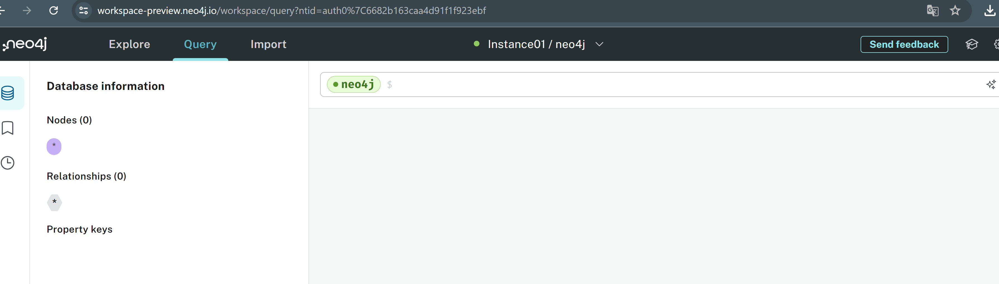
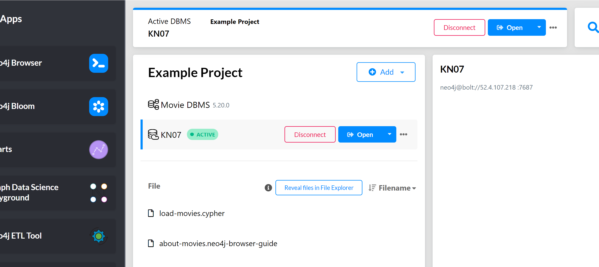
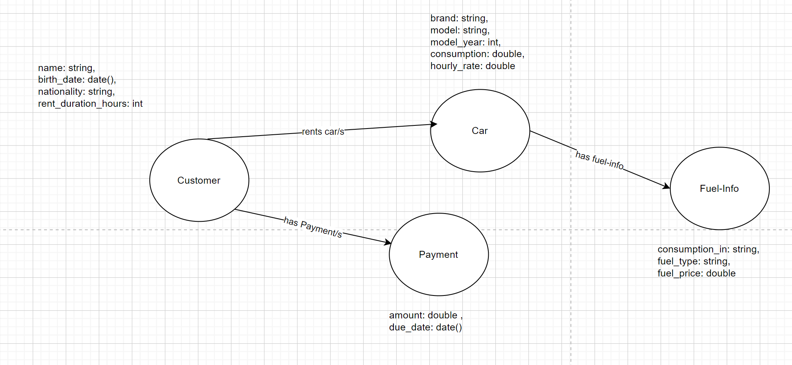

# KN07: Installation und Datenmodellierung für Neo4j

### A: Installation / Account erstellen (30%)

### B) Logisches Modell für Neo4j (70%)

[Drawio](./bin/konzeptionell.drawio)

Bei den Kanten habe ich nur die Beziehungen beschriftet und die Pfeile in die entsprechenden Richtungen gemacht. Die Attribute habe ich wie bei KN02 gemacht. Die Verschachtelung habe ich nicht eingesetzt da ich die es mit den Kanten bzw. Relationsships lösen konnte und es auch nicht nötig ist.

