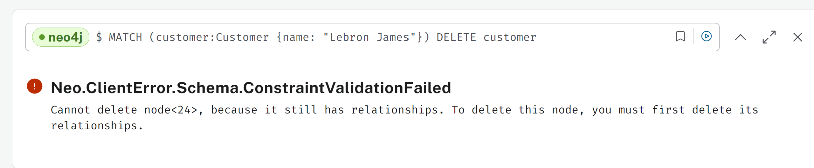
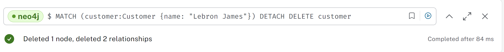

# KN08: Datenabfrage und -Manipulation 
## A) Daten hinzufügen (20%)

[Script](bin/neo4j_insert.txt)

## B) Daten abfragen (20%)

### Erklärung des Statements, um alle Knoten und Kanten zu lesen, speziell die OPTIONAL
Klausel

Mit ``` OPTIONAL ``` kann man auch nodes bekommen, welche keine Beziehungen haben. Normalerweise würde also ``` MATCH ``` alleine nur die Nodes aufzeigen die auch verbunden bzw. vorhandene Beziehung haben.
Alles wird hier zurückgegeben am Ende, das heisst dann auch, dass Nodes ohne Beziehungen z.B. dann bei r für Relationsships null stehen haben, aber dennoch angezeigt werden. 

### Szenario 1:

1. Anwendungsfall: Finden aller Kunden, die ein bestimmtes Auto mieten

Prosa: Wir möchten alle Kunden finden, die ein BMW M3 mieten


Cypher-Statement:
```
MATCH (customer:Customer)-[:RENTS]->(car:Car {brand: "BMW", model: "M3"})
RETURN customer.name, car.brand, car.model
```

### Szenario 2:

2. Anwendungsfall: Alle Autos mit dazuhörenden Fuel-Info

Prosa: Wir möchten eine Liste von allen Autos mit ihren Kraftstoffinfos bekommen.


Cypher-Statement:
```
MATCH (car:Car)-[:HAS_FUEL_INFO]->(fuel:FuelInfo)
RETURN car.brand, car.model, fuel.fuel_type, fuel.fuel_price
```

### Szenario 3: 

3. Anwendungsfall: Aller Payments von schweizerischen Kunden die über 100 sind

Prosa: Wir möchten alle Zahlungen von Kunden spezifisch ihrer Nationalität finden und mehr als 100 bezahlen müssen.


Cypher-Statement:
```
MATCH (customer:Customer {nationality: "Swiss"})-[:HAS_PAYMENT]->(payment:Payment)
WHERE payment.amount > 100
RETURN customer.name, payment.amount, payment.due_date
```

### Szenario 4: 

4. Anwendungsfall: Teure Fahrzeuge identifizieren mit ihren Infos und nach Preis sortieren

Prosa: Wir möchten alle Autos finden, die einen Stundenpreis von über 30 haben und ihre Infos inkl. Treibstoff anzeigen und nach dem Preis sortieren.

Cypher-Statement:
```
MATCH (car:Car)-[:HAS_FUEL_INFO]->(fuel:FuelInfo)
WHERE car.hourly_rate > 30
RETURN car.brand AS Brand, car.model AS Model, car.hourly_rate AS HourlyRate, fuel.fuel_type AS FuelType
ORDER BY car.hourly_rate desc
```

## C) Daten löschen (20%)

```
MATCH (customer:Customer {name: "Lebron James"})
DELETE customer
```

Dieser Befehl schlägt fehl, da wie das Bild es schon aussagt, da wenn der Node "customer" noch Beziehungen hat, es nicht gelöscht werden kan.




```
MATCH (customer:Customer {name: "Lebron James"})
DETACH DELETE customer
```

Nun aber mit ``` DETACH ``` zusätzlich funktioniert es, denn dieser löst bevor dem löschen des Nodes die vorhandenen Beziehungen auf (bzw löscht). 


## D) Daten verändern (20%)

### Szenario 1:

1. Anwendungsfall: Aktualisieren des Stundensatzes eines Autos

Prosa: Wir möchten den Stundensatz des BMW M3 auf 65.0 erhöhen


Cypher-Statement:
```
MATCH (car:Car {brand: "BMW", model: "M3"})
SET car.hourly_rate = 55.0
RETURN car.brand, car.model, car.hourly_rate

```

### Szenario 2: 

2. Anwendungsfall:Neue Miete mit Zahlung für einen Kunden

Prosa: Wir möchten eine neue Zahlung und Mietwagen für Michael Jordan hinzufügen.


Cypher-Statement:
```
MATCH (customer:Customer {name: "Michael Jordan"})
MATCH (car:Car {brand: "BMW", model: "M3"})
CREATE (payment:Payment {amount: 200.00, due_date: date("2024-07-01")})
CREATE (customer)-[:HAS_PAYMENT]->(payment)
CREATE (customer)-[:RENTS]->(car)
RETURN customer.name, payment.amount, payment.due_date, car.brand, car.model
```

### Szenario 3:

Anwendungsfall: Treibstoffpreise erhöhen

Prosa: Wir möchten die Kraftstoffpreise für alle Dieselautos auf 2.00 erhöhen.

Cypher-Statement:
```
MATCH (fuel:FuelInfo {fuel_type: "Diesel"})
SET fuel.fuel_price = 2.00
RETURN fuel.fuel_type, fuel.fuel_price
```

## E) Zusätzliche Klauseln (20%)
### 1. UNION

Erklärung:
UNION Klausel ist dazu da um Ergebnisse zweier Abfragen zu kombinieren, hierbei müssen die beiden Abfragen aber gleiche Anzahl und Typ von spalten zürückgeben.

Anwendungsfall:
Wir wollen eine kombinierte Liste von Kunden bekommen, die entweder ein spezifisches Auto mieten oder bestimmte Zahlung haben
Cypher-Statement:

``
MATCH (customer:Customer)-[:RENTS]->(car:Car {brand: "BMW"})
RETURN customer.name AS Name, car.brand AS Info, "Car" AS Type
UNION
MATCH (customer:Customer)-[:HAS_PAYMENT]->(payment:Payment)
WHERE payment.amount > 100
RETURN customer.name AS Name, payment.amount AS Info, "Payment" AS Type
```

Erklärung meines spezifischen Beispieles:
Dieses Statement findet zuerst alle Acts und dann alle Sponsoren des Openairs. UNION fügt diese beiden Listen zu einer zusammen.

### 2. MERGE

Erklärung:
MERGE Klausel stellt sicher dass eine Beziehung vorhanden ist, wenn sie nicht da ist wird sie dann aber hergestellt.

Anwendungsfall: Überprüfen ob ein Kunde eine Beziehung zu einem bestimmten Auto hat, wenn es nicht existiert soll eine Beziehung gemacht werden.

Cypher-Statement:
```
MATCH (customer:Customer {name: "Stephen Curry"})
MATCH (car:Car {brand: "Volkswagen", model: "Golf"})
MERGE (customer)-[:RENTS]->(car)
RETURN customer.name, car.brand, car.model
```


